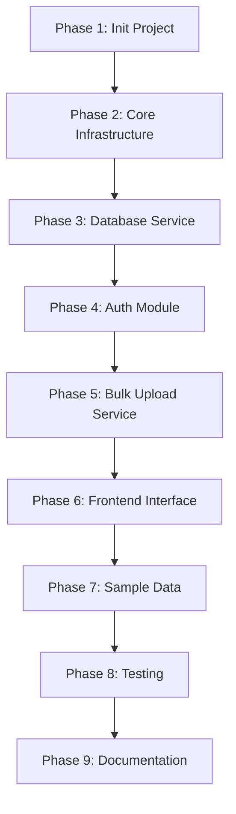

# 🚀 Backend Technical Test — Full Implementation Plan

> **Candidate:** Abdelrahman  
> **Repo:** `Webelocity/Backend-Interview-2026-01` (Fork)  
> **Deadline:** Saturday night 12:00 AM Cairo time  
> **Start Time:** 2026-02-27 20:07 (Cairo)

---

## 📋 Task Summary

| Requirement | Status |
|---|---|
| CSV bulk upload to JSON "database" | ✅ |
| Authentication / abuse prevention | ✅ |
| Small interface (UI) for running the service | ✅ |
| Track exact time taken | ⬜ |
| **Bonus:** Service documentation | ⬜ |
| **Bonus:** Tests | ⬜ |

---

## 🏗️ Existing Repo Structure (What We're Given)

```
Backend-Interview-2026-01/
├── .gitignore                      # NestJS-oriented gitignore
├── data/
│   └── bulk-upload-temp.json       # The "database" — JSON file with records[] and metadata
├── src/
│   ├── models/
│   │   └── bulk-upload-record.model.ts   # BulkUploadRecord interface (given)
│   └── routes/
│       └── bulk-upload.routes.ts         # Placeholder — we implement here
```

### Key Observations

1. **[.gitignore](file:///c:/Users/Bedo/Desktop/interview-prepage/Backend-Interview-2026-01/.gitignore) hints at NestJS** — contains `/dist`, `node_modules`, NestJS-specific patterns
2. **TypeScript files** — the project uses [.ts](file:///c:/Users/Bedo/Desktop/interview-prepage/Backend-Interview-2026-01/src/routes/bulk-upload.routes.ts) extension
3. **[BulkUploadRecord](file:///c:/Users/Bedo/Desktop/interview-prepage/Backend-Interview-2026-01/src/models/bulk-upload-record.model.ts#5-17) interface** is pre-defined with: `id`, `data`, `status`, `createdAt`, `error`
4. **[bulk-upload-temp.json](file:///c:/Users/Bedo/Desktop/interview-prepage/Backend-Interview-2026-01/data/bulk-upload-temp.json)** is the simulated database — we read/write this file
5. **No `package.json`** exists yet — we need to initialize the project
6. **No framework installed** — we choose NestJS (matches [.gitignore](file:///c:/Users/Bedo/Desktop/interview-prepage/Backend-Interview-2026-01/.gitignore) hints)

---

## 🎯 Technology Stack & Design Decisions

| Choice | Technology | Reasoning |
|---|---|---|
| **Framework** | NestJS | [.gitignore](file:///c:/Users/Bedo/Desktop/interview-prepage/Backend-Interview-2026-01/.gitignore) hints at NestJS; professional, modular, TypeScript-native |
| **CSV Parsing** | `csv-parser` (streaming) | Memory-efficient, handles large files via streams |
| **File Upload** | `multer` (via `@nestjs/platform-express`) | Standard multipart form-data handling |
| **Authentication** | API Key + JWT combo | Simple but effective; API key for service-to-service, JWT for UI users |
| **Rate Limiting** | `@nestjs/throttler` | Built-in NestJS solution for DoS/DDoS prevention |
| **Validation** | `class-validator` + `class-transformer` | NestJS-native input validation |
| **Frontend** | Embedded static HTML/JS (served by NestJS) | "Small interface" — no separate frontend framework needed |
| **Testing** | Jest (built into NestJS) | Unit + Integration tests |
| **Documentation** | Swagger (`@nestjs/swagger`) + README | Professional API docs |

---

## 📁 Target Project Structure

```
Backend-Interview-2026-01/
├── .gitignore
├── .env.example                          # Environment variable template
├── .env                                  # Actual env vars (gitignored)
├── package.json
├── tsconfig.json
├── tsconfig.build.json
├── nest-cli.json
├── README.md                             # Full documentation
├── TIME_TRACKING.md                      # Exact time tracking
├── data/
│   └── bulk-upload-temp.json             # Simulated DB (given)
├── public/                               # Static frontend
│   └── index.html                        # Upload interface
├── src/
│   ├── main.ts                           # App bootstrap
│   ├── app.module.ts                     # Root module
│   ├── app.controller.ts                 # Health check / serve frontend
│   │
│   ├── config/                           # Configuration
│   │   └── app.config.ts                 # Centralized config
│   │
│   ├── auth/                             # Authentication module
│   │   ├── auth.module.ts
│   │   ├── auth.controller.ts            # Login endpoint
│   │   ├── auth.service.ts               # JWT generation, API key validation
│   │   ├── guards/
│   │   │   ├── api-key.guard.ts          # API key guard
│   │   │   └── jwt-auth.guard.ts         # JWT guard
│   │   ├── strategies/
│   │   │   └── jwt.strategy.ts           # Passport JWT strategy
│   │   └── dto/
│   │       └── login.dto.ts              # Login request DTO
│   │
│   ├── bulk-upload/                      # Bulk Upload module
│   │   ├── bulk-upload.module.ts
│   │   ├── bulk-upload.controller.ts     # Upload endpoint
│   │   ├── bulk-upload.service.ts        # CSV parsing + DB write logic
│   │   └── dto/
│   │       └── upload-response.dto.ts    # Response DTO
│   │
│   ├── database/                         # JSON "Database" module
│   │   ├── database.module.ts
│   │   └── database.service.ts           # Read/write to JSON file
│   │
│   ├── models/                           # Given models
│   │   └── bulk-upload-record.model.ts   # (existing — untouched)
│   │
│   ├── routes/                           # Given routes
│   │   └── bulk-upload.routes.ts         # (existing — we can update or reference)
│   │
│   └── common/                           # Shared utilities
│       ├── filters/
│       │   └── http-exception.filter.ts  # Global exception filter
│       └── interceptors/
│           └── logging.interceptor.ts    # Request logging
│
├── test/                                 # Tests
│   ├── auth/
│   │   └── auth.service.spec.ts
│   ├── bulk-upload/
│   │   ├── bulk-upload.controller.spec.ts
│   │   └── bulk-upload.service.spec.ts
│   ├── database/
│   │   └── database.service.spec.ts
│   └── e2e/
│       └── bulk-upload.e2e-spec.ts
│
└── samples/                              # Sample CSV files for testing
    ├── valid-sample.csv
    ├── large-sample.csv
    └── invalid-sample.csv
```

---

## 🔄 Implementation Phases

---

### Phase 1: Project Initialization & Configuration ⏱️ ~15 min

#### Step 1.1 — Initialize NestJS Project

```bash
# Initialize package.json and install NestJS dependencies
npm init -y
npm install @nestjs/core @nestjs/common @nestjs/platform-express reflect-metadata rxjs
npm install -D @nestjs/cli @nestjs/schematics typescript @types/node @types/express ts-node
```

#### Step 1.2 — TypeScript Configuration

Create `tsconfig.json`:
```json
{
  "compilerOptions": {
    "module": "commonjs",
    "declaration": true,
    "removeComments": true,
    "emitDecoratorMetadata": true,
    "experimentalDecorators": true,
    "allowSyntheticDefaultImports": true,
    "target": "ES2021",
    "sourceMap": true,
    "outDir": "./dist",
    "baseUrl": "./",
    "incremental": true,
    "skipLibCheck": true,
    "strictNullChecks": true,
    "noImplicitAny": true,
    "strictBindCallApply": true,
    "forceConsistentCasingInFileNames": true,
    "noFallthroughCasesInSwitch": true,
    "paths": {
      "@/*": ["src/*"]
    }
  }
}
```

Create `tsconfig.build.json`:
```json
{
  "extends": "./tsconfig.json",
  "exclude": ["node_modules", "test", "dist", "**/*spec.ts"]
}
```

Create `nest-cli.json`:
```json
{
  "$schema": "https://json.schemastore.org/nest-cli",
  "collection": "@nestjs/schematics",
  "sourceRoot": "src",
  "compilerOptions": {
    "deleteOutDir": true,
    "assets": ["**/*.html"]
  }
}
```

#### Step 1.3 — Environment Configuration

Create `.env.example`:
```env
# Server
PORT=3000

# Authentication
JWT_SECRET=your-super-secret-jwt-key-change-in-production
JWT_EXPIRATION=1h
API_KEY=your-api-key-change-in-production

# Rate Limiting
THROTTLE_TTL=60
THROTTLE_LIMIT=10

# Admin Credentials (for UI login)
ADMIN_USERNAME=admin
ADMIN_PASSWORD=admin123
```

Create `.env` with actual values (same as example for dev).

Add `.env` to [.gitignore](file:///c:/Users/Bedo/Desktop/interview-prepage/Backend-Interview-2026-01/.gitignore) (already there).

#### Step 1.4 — Package.json Scripts

Update `package.json` scripts:
```json
{
  "scripts": {
    "build": "nest build",
    "start": "nest start",
    "start:dev": "nest start --watch",
    "start:prod": "node dist/main",
    "test": "jest",
    "test:watch": "jest --watch",
    "test:cov": "jest --coverage",
    "test:e2e": "jest --config ./test/jest-e2e.json"
  }
}
```

#### Step 1.5 — Install All Dependencies

```bash
# Core
npm install @nestjs/config @nestjs/passport @nestjs/jwt passport passport-jwt
npm install @nestjs/throttler @nestjs/serve-static
npm install csv-parser multer uuid class-validator class-transformer
npm install @nestjs/swagger swagger-ui-express

# Dev
npm install -D @types/multer @types/passport-jwt @types/uuid jest @nestjs/testing
npm install -D ts-jest @types/jest supertest @types/supertest
```

---

### Phase 2: Core Infrastructure ⏱️ ~20 min

#### Step 2.1 — App Bootstrap (`src/main.ts`)

```typescript
import { NestFactory } from '@nestjs/core';
import { ValidationPipe } from '@nestjs/common';
import { SwaggerModule, DocumentBuilder } from '@nestjs/swagger';
import { AppModule } from './app.module';
import { HttpExceptionFilter } from './common/filters/http-exception.filter';
import { LoggingInterceptor } from './common/interceptors/logging.interceptor';

async function bootstrap() {
  const app = await NestFactory.create(AppModule);

  // Global pipes
  app.useGlobalPipes(new ValidationPipe({
    whitelist: true,
    forbidNonWhitelisted: true,
    transform: true,
  }));

  // Global filters & interceptors
  app.useGlobalFilters(new HttpExceptionFilter());
  app.useGlobalInterceptors(new LoggingInterceptor());

  // CORS
  app.enableCors();

  // Swagger Documentation
  const config = new DocumentBuilder()
    .setTitle('Bulk Upload Service')
    .setDescription('CSV bulk upload service with authentication and rate limiting')
    .setVersion('1.0')
    .addBearerAuth()
    .addApiKey({ type: 'apiKey', name: 'x-api-key', in: 'header' }, 'api-key')
    .build();
  const document = SwaggerModule.createDocument(app, config);
  SwaggerModule.setup('api/docs', app, document);

  const port = process.env.PORT || 3000;
  await app.listen(port);
  console.log(`🚀 Application running on: http://localhost:${port}`);
  console.log(`📚 Swagger docs at: http://localhost:${port}/api/docs`);
  console.log(`🖥️  Upload interface at: http://localhost:${port}`);
}
bootstrap();
```

#### Step 2.2 — Root Module (`src/app.module.ts`)

```typescript
import { Module } from '@nestjs/common';
import { ConfigModule } from '@nestjs/config';
import { ThrottlerModule, ThrottlerGuard } from '@nestjs/throttler';
import { ServeStaticModule } from '@nestjs/serve-static';
import { APP_GUARD } from '@nestjs/core';
import { join } from 'path';
import { AuthModule } from './auth/auth.module';
import { BulkUploadModule } from './bulk-upload/bulk-upload.module';
import { DatabaseModule } from './database/database.module';

@Module({
  imports: [
    // Load .env
    ConfigModule.forRoot({ isGlobal: true }),

    // Rate limiting (global) — DoS/DDoS protection
    ThrottlerModule.forRoot([{
      ttl: parseInt(process.env.THROTTLE_TTL) || 60,
      limit: parseInt(process.env.THROTTLE_LIMIT) || 10,
    }]),

    // Serve static frontend
    ServeStaticModule.forRoot({
      rootPath: join(__dirname, '..', 'public'),
    }),

    AuthModule,
    BulkUploadModule,
    DatabaseModule,
  ],
  providers: [
    // Apply rate limiting globally
    { provide: APP_GUARD, useClass: ThrottlerGuard },
  ],
})
export class AppModule {}
```

#### Step 2.3 — Global Exception Filter

```typescript
// src/common/filters/http-exception.filter.ts
import {
  ExceptionFilter, Catch, ArgumentsHost, HttpException, HttpStatus, Logger,
} from '@nestjs/common';
import { Request, Response } from 'express';

@Catch()
export class HttpExceptionFilter implements ExceptionFilter {
  private readonly logger = new Logger(HttpExceptionFilter.name);

  catch(exception: unknown, host: ArgumentsHost) {
    const ctx = host.switchToHttp();
    const response = ctx.getResponse<Response>();
    const request = ctx.getRequest<Request>();

    const status = exception instanceof HttpException
      ? exception.getStatus()
      : HttpStatus.INTERNAL_SERVER_ERROR;

    const message = exception instanceof HttpException
      ? exception.getResponse()
      : 'Internal server error';

    this.logger.error(
      `${request.method} ${request.url} ${status}`,
      exception instanceof Error ? exception.stack : '',
    );

    response.status(status).json({
      statusCode: status,
      timestamp: new Date().toISOString(),
      path: request.url,
      message: typeof message === 'string' ? message : (message as any).message || message,
    });
  }
}
```

#### Step 2.4 — Logging Interceptor

```typescript
// src/common/interceptors/logging.interceptor.ts
import {
  Injectable, NestInterceptor, ExecutionContext, CallHandler, Logger,
} from '@nestjs/common';
import { Observable, tap } from 'rxjs';

@Injectable()
export class LoggingInterceptor implements NestInterceptor {
  private readonly logger = new Logger('HTTP');

  intercept(context: ExecutionContext, next: CallHandler): Observable<any> {
    const req = context.switchToHttp().getRequest();
    const { method, url } = req;
    const now = Date.now();

    return next.handle().pipe(
      tap(() => {
        const res = context.switchToHttp().getResponse();
        this.logger.log(`${method} ${url} ${res.statusCode} - ${Date.now() - now}ms`);
      }),
    );
  }
}
```

---

### Phase 3: Database Service (JSON File I/O) ⏱️ ~15 min

#### Step 3.1 — Database Module & Service

```typescript
// src/database/database.module.ts
import { Module, Global } from '@nestjs/common';
import { DatabaseService } from './database.service';

@Global()
@Module({
  providers: [DatabaseService],
  exports: [DatabaseService],
})
export class DatabaseModule {}
```

```typescript
// src/database/database.service.ts
import { Injectable, Logger, OnModuleInit } from '@nestjs/common';
import * as fs from 'fs/promises';
import * as path from 'path';
import { BulkUploadRecord } from '../models/bulk-upload-record.model';

export interface DatabaseSchema {
  records: BulkUploadRecord[];
  metadata: {
    createdAt: string | null;
    updatedAt: string | null;
    description: string;
  };
}

@Injectable()
export class DatabaseService implements OnModuleInit {
  private readonly logger = new Logger(DatabaseService.name);
  private readonly dbPath = path.join(process.cwd(), 'data', 'bulk-upload-temp.json');

  async onModuleInit() {
    // Ensure the data directory and file exist
    const dir = path.dirname(this.dbPath);
    await fs.mkdir(dir, { recursive: true });
    try {
      await fs.access(this.dbPath);
    } catch {
      await this.resetDatabase();
    }
    this.logger.log(`Database initialized at: ${this.dbPath}`);
  }

  /** Read the entire database */
  async read(): Promise<DatabaseSchema> {
    const raw = await fs.readFile(this.dbPath, 'utf-8');
    return JSON.parse(raw);
  }

  /** Write the entire database */
  async write(data: DatabaseSchema): Promise<void> {
    data.metadata.updatedAt = new Date().toISOString();
    if (!data.metadata.createdAt) {
      data.metadata.createdAt = data.metadata.updatedAt;
    }
    await fs.writeFile(this.dbPath, JSON.stringify(data, null, 2), 'utf-8');
  }

  /** Add multiple records (bulk insert) */
  async bulkInsert(records: BulkUploadRecord[]): Promise<{ inserted: number; total: number }> {
    const db = await this.read();
    db.records.push(...records);
    await this.write(db);
    this.logger.log(`Bulk inserted ${records.length} records. Total: ${db.records.length}`);
    return { inserted: records.length, total: db.records.length };
  }

  /** Get all records */
  async getAllRecords(): Promise<BulkUploadRecord[]> {
    const db = await this.read();
    return db.records;
  }

  /** Get record count */
  async getRecordCount(): Promise<number> {
    const db = await this.read();
    return db.records.length;
  }

  /** Clear all records (reset) */
  async resetDatabase(): Promise<void> {
    const emptyDb: DatabaseSchema = {
      records: [],
      metadata: {
        createdAt: null,
        updatedAt: null,
        description: 'Temporary store for bulk upload records (see BulkUploadRecord model). Replace nulls with ISO 8601 dates when writing.',
      },
    };
    await this.write(emptyDb);
    this.logger.log('Database reset');
  }
}
```

> [!IMPORTANT]
> The database service uses a simple file lock-free approach. For production, you'd want proper file locking or a real database. This is acceptable for the interview task since it's a simulated DB.

---

### Phase 4: Authentication Module ⏱️ ~25 min

#### Step 4.1 — Install Additional Auth Dependencies (already in Phase 1)

#### Step 4.2 — Auth Module

```typescript
// src/auth/auth.module.ts
import { Module } from '@nestjs/common';
import { JwtModule } from '@nestjs/jwt';
import { PassportModule } from '@nestjs/passport';
import { ConfigModule, ConfigService } from '@nestjs/config';
import { AuthController } from './auth.controller';
import { AuthService } from './auth.service';
import { JwtStrategy } from './strategies/jwt.strategy';

@Module({
  imports: [
    PassportModule.register({ defaultStrategy: 'jwt' }),
    JwtModule.registerAsync({
      imports: [ConfigModule],
      useFactory: (configService: ConfigService) => ({
        secret: configService.get<string>('JWT_SECRET', 'default-secret'),
        signOptions: {
          expiresIn: configService.get<string>('JWT_EXPIRATION', '1h'),
        },
      }),
      inject: [ConfigService],
    }),
  ],
  controllers: [AuthController],
  providers: [AuthService, JwtStrategy],
  exports: [AuthService, JwtModule],
})
export class AuthModule {}
```

#### Step 4.3 — Auth Service

```typescript
// src/auth/auth.service.ts
import { Injectable, UnauthorizedException, Logger } from '@nestjs/common';
import { JwtService } from '@nestjs/jwt';
import { ConfigService } from '@nestjs/config';

@Injectable()
export class AuthService {
  private readonly logger = new Logger(AuthService.name);

  constructor(
    private readonly jwtService: JwtService,
    private readonly configService: ConfigService,
  ) {}

  /** Validate username/password and return a JWT */
  async login(username: string, password: string): Promise<{ access_token: string }> {
    const adminUser = this.configService.get<string>('ADMIN_USERNAME', 'admin');
    const adminPass = this.configService.get<string>('ADMIN_PASSWORD', 'admin123');

    if (username !== adminUser || password !== adminPass) {
      this.logger.warn(`Failed login attempt for user: ${username}`);
      throw new UnauthorizedException('Invalid credentials');
    }

    const payload = { sub: username, role: 'admin' };
    const access_token = this.jwtService.sign(payload);

    this.logger.log(`User '${username}' logged in successfully`);
    return { access_token };
  }

  /** Validate an API key */
  validateApiKey(apiKey: string): boolean {
    const validKey = this.configService.get<string>('API_KEY', 'your-api-key');
    return apiKey === validKey;
  }
}
```

#### Step 4.4 — JWT Strategy

```typescript
// src/auth/strategies/jwt.strategy.ts
import { Injectable, UnauthorizedException } from '@nestjs/common';
import { PassportStrategy } from '@nestjs/passport';
import { ExtractJwt, Strategy } from 'passport-jwt';
import { ConfigService } from '@nestjs/config';

@Injectable()
export class JwtStrategy extends PassportStrategy(Strategy) {
  constructor(private readonly configService: ConfigService) {
    super({
      jwtFromRequest: ExtractJwt.fromAuthHeaderAsBearerToken(),
      ignoreExpiration: false,
      secretOrKey: configService.get<string>('JWT_SECRET', 'default-secret'),
    });
  }

  async validate(payload: any) {
    if (!payload.sub) {
      throw new UnauthorizedException();
    }
    return { username: payload.sub, role: payload.role };
  }
}
```

#### Step 4.5 — Auth Guards

```typescript
// src/auth/guards/jwt-auth.guard.ts
import { Injectable, ExecutionContext } from '@nestjs/common';
import { AuthGuard } from '@nestjs/passport';

@Injectable()
export class JwtAuthGuard extends AuthGuard('jwt') {
  canActivate(context: ExecutionContext) {
    return super.canActivate(context);
  }
}
```

```typescript
// src/auth/guards/api-key.guard.ts
import { Injectable, CanActivate, ExecutionContext, UnauthorizedException } from '@nestjs/common';
import { AuthService } from '../auth.service';

@Injectable()
export class ApiKeyGuard implements CanActivate {
  constructor(private readonly authService: AuthService) {}

  canActivate(context: ExecutionContext): boolean {
    const request = context.switchToHttp().getRequest();
    const apiKey = request.headers['x-api-key'];

    if (!apiKey || !this.authService.validateApiKey(apiKey)) {
      throw new UnauthorizedException('Invalid or missing API key');
    }
    return true;
  }
}
```

#### Step 4.6 — Login DTO

```typescript
// src/auth/dto/login.dto.ts
import { IsString, IsNotEmpty } from 'class-validator';
import { ApiProperty } from '@nestjs/swagger';

export class LoginDto {
  @ApiProperty({ example: 'admin', description: 'Username' })
  @IsString()
  @IsNotEmpty()
  username: string;

  @ApiProperty({ example: 'admin123', description: 'Password' })
  @IsString()
  @IsNotEmpty()
  password: string;
}
```

#### Step 4.7 — Auth Controller

```typescript
// src/auth/auth.controller.ts
import { Controller, Post, Body, HttpCode, HttpStatus } from '@nestjs/common';
import { ApiTags, ApiOperation, ApiResponse } from '@nestjs/swagger';
import { AuthService } from './auth.service';
import { LoginDto } from './dto/login.dto';

@ApiTags('Authentication')
@Controller('api/auth')
export class AuthController {
  constructor(private readonly authService: AuthService) {}

  @Post('login')
  @HttpCode(HttpStatus.OK)
  @ApiOperation({ summary: 'Login to obtain JWT token' })
  @ApiResponse({ status: 200, description: 'Returns JWT access token' })
  @ApiResponse({ status: 401, description: 'Invalid credentials' })
  async login(@Body() loginDto: LoginDto) {
    return this.authService.login(loginDto.username, loginDto.password);
  }
}
```

---

### Phase 5: Bulk Upload Service (Core Logic) ⏱️ ~30 min

This is the **heart of the application** — CSV parsing, validation, and database insertion.

#### Step 5.1 — Bulk Upload Module

```typescript
// src/bulk-upload/bulk-upload.module.ts
import { Module } from '@nestjs/common';
import { BulkUploadController } from './bulk-upload.controller';
import { BulkUploadService } from './bulk-upload.service';
import { AuthModule } from '../auth/auth.module';

@Module({
  imports: [AuthModule],
  controllers: [BulkUploadController],
  providers: [BulkUploadService],
})
export class BulkUploadModule {}
```

#### Step 5.2 — Upload Response DTO

```typescript
// src/bulk-upload/dto/upload-response.dto.ts
import { ApiProperty } from '@nestjs/swagger';

export class UploadResponseDto {
  @ApiProperty({ example: true })
  success: boolean;

  @ApiProperty({ example: 'Successfully uploaded 100 records' })
  message: string;

  @ApiProperty({ example: 100 })
  recordsInserted: number;

  @ApiProperty({ example: 0 })
  recordsFailed: number;

  @ApiProperty({ example: 150 })
  totalRecordsInDb: number;

  @ApiProperty({ example: '245ms' })
  processingTime: string;

  @ApiProperty({ required: false })
  errors?: string[];
}
```

#### Step 5.3 — Bulk Upload Service (CSV Parsing + DB Write)

```typescript
// src/bulk-upload/bulk-upload.service.ts
import { Injectable, BadRequestException, Logger } from '@nestjs/common';
import { DatabaseService } from '../database/database.service';
import { BulkUploadRecord } from '../models/bulk-upload-record.model';
import { UploadResponseDto } from './dto/upload-response.dto';
import * as csvParser from 'csv-parser';
import { v4 as uuidv4 } from 'uuid';
import { Readable } from 'stream';

@Injectable()
export class BulkUploadService {
  private readonly logger = new Logger(BulkUploadService.name);

  constructor(private readonly databaseService: DatabaseService) {}

  /**
   * Process a CSV file buffer and insert records into the database.
   *
   * Design decisions:
   * - Uses streaming CSV parser for memory efficiency (handles large files)
   * - Each row becomes a BulkUploadRecord with a UUID
   * - All data fields are stored in the `data` property as key-value pairs
   * - Failed rows are tracked but don't stop the entire upload
   */
  async processCSV(fileBuffer: Buffer, filename: string): Promise<UploadResponseDto> {
    const startTime = Date.now();

    if (!filename.toLowerCase().endsWith('.csv')) {
      throw new BadRequestException('Only CSV files are accepted');
    }

    if (fileBuffer.length === 0) {
      throw new BadRequestException('Uploaded file is empty');
    }

    this.logger.log(`Processing CSV file: ${filename} (${fileBuffer.length} bytes)`);

    // Parse CSV from buffer using streaming
    const records: BulkUploadRecord[] = [];
    const errors: string[] = [];
    let rowIndex = 0;

    try {
      await new Promise<void>((resolve, reject) => {
        const stream = Readable.from(fileBuffer.toString('utf-8'));
        stream
          .pipe(csvParser())
          .on('data', (row: Record<string, string>) => {
            rowIndex++;
            try {
              // Validate: skip completely empty rows
              const hasData = Object.values(row).some(v => v && v.trim() !== '');
              if (!hasData) {
                errors.push(`Row ${rowIndex}: empty row skipped`);
                return;
              }

              const record: BulkUploadRecord = {
                id: uuidv4(),
                data: this.normalizeRow(row),
                status: 'processed',
                createdAt: new Date().toISOString(),
              };
              records.push(record);
            } catch (err) {
              errors.push(`Row ${rowIndex}: ${err.message}`);
            }
          })
          .on('end', resolve)
          .on('error', reject);
      });
    } catch (err) {
      throw new BadRequestException(`Failed to parse CSV: ${err.message}`);
    }

    if (records.length === 0) {
      throw new BadRequestException('No valid records found in the CSV file');
    }

    // Bulk insert into "database"
    const result = await this.databaseService.bulkInsert(records);

    const processingTime = Date.now() - startTime;
    this.logger.log(`Processed ${records.length} records in ${processingTime}ms`);

    return {
      success: true,
      message: `Successfully uploaded ${records.length} records from ${filename}`,
      recordsInserted: result.inserted,
      recordsFailed: errors.length,
      totalRecordsInDb: result.total,
      processingTime: `${processingTime}ms`,
      errors: errors.length > 0 ? errors : undefined,
    };
  }

  /**
   * Normalize a CSV row:
   * - Trim whitespace from keys and values
   * - Convert numeric strings to numbers
   * - Convert "true"/"false" to booleans
   * - Convert empty strings to null
   */
  private normalizeRow(row: Record<string, string>): Record<string, string | number | boolean | null> {
    const normalized: Record<string, string | number | boolean | null> = {};
    for (const [key, value] of Object.entries(row)) {
      const trimKey = key.trim();
      const trimVal = value?.trim();

      if (!trimVal || trimVal === '') {
        normalized[trimKey] = null;
      } else if (trimVal.toLowerCase() === 'true') {
        normalized[trimKey] = true;
      } else if (trimVal.toLowerCase() === 'false') {
        normalized[trimKey] = false;
      } else if (!isNaN(Number(trimVal)) && trimVal !== '') {
        normalized[trimKey] = Number(trimVal);
      } else {
        normalized[trimKey] = trimVal;
      }
    }
    return normalized;
  }

  /** Get all records from the database */
  async getRecords(): Promise<BulkUploadRecord[]> {
    return this.databaseService.getAllRecords();
  }

  /** Reset the database */
  async resetDatabase(): Promise<{ message: string }> {
    await this.databaseService.resetDatabase();
    return { message: 'Database has been reset successfully' };
  }
}
```

#### Step 5.4 — Bulk Upload Controller

```typescript
// src/bulk-upload/bulk-upload.controller.ts
import {
  Controller, Post, Get, Delete, UseGuards, UseInterceptors,
  UploadedFile, HttpCode, HttpStatus, ParseFilePipe, MaxFileSizeValidator,
  FileTypeValidator,
} from '@nestjs/common';
import { FileInterceptor } from '@nestjs/platform-express';
import { ApiTags, ApiOperation, ApiResponse, ApiBearerAuth, ApiConsumes, ApiBody } from '@nestjs/swagger';
import { JwtAuthGuard } from '../auth/guards/jwt-auth.guard';
import { BulkUploadService } from './bulk-upload.service';
import { UploadResponseDto } from './dto/upload-response.dto';

@ApiTags('Bulk Upload')
@ApiBearerAuth()
@UseGuards(JwtAuthGuard)
@Controller('api/bulk-upload')
export class BulkUploadController {
  constructor(private readonly bulkUploadService: BulkUploadService) {}

  @Post('upload')
  @HttpCode(HttpStatus.CREATED)
  @UseInterceptors(FileInterceptor('file'))
  @ApiOperation({ summary: 'Upload a CSV file for bulk record insertion' })
  @ApiConsumes('multipart/form-data')
  @ApiBody({
    schema: {
      type: 'object',
      properties: {
        file: { type: 'string', format: 'binary', description: 'CSV file to upload' },
      },
    },
  })
  @ApiResponse({ status: 201, description: 'Records uploaded successfully', type: UploadResponseDto })
  @ApiResponse({ status: 400, description: 'Invalid file or CSV format' })
  @ApiResponse({ status: 401, description: 'Unauthorized' })
  @ApiResponse({ status: 429, description: 'Rate limit exceeded' })
  async uploadCSV(
    @UploadedFile(
      new ParseFilePipe({
        validators: [
          new MaxFileSizeValidator({ maxSize: 10 * 1024 * 1024 }), // 10MB max
        ],
      }),
    ) file: Express.Multer.File,
  ): Promise<UploadResponseDto> {
    return this.bulkUploadService.processCSV(file.buffer, file.originalname);
  }

  @Get('records')
  @ApiOperation({ summary: 'Get all uploaded records' })
  @ApiResponse({ status: 200, description: 'Returns all records' })
  @ApiResponse({ status: 401, description: 'Unauthorized' })
  async getRecords() {
    const records = await this.bulkUploadService.getRecords();
    return { success: true, count: records.length, records };
  }

  @Delete('records')
  @HttpCode(HttpStatus.OK)
  @ApiOperation({ summary: 'Reset/clear all records from the database' })
  @ApiResponse({ status: 200, description: 'Database reset successfully' })
  @ApiResponse({ status: 401, description: 'Unauthorized' })
  async resetDatabase() {
    return this.bulkUploadService.resetDatabase();
  }
}
```

---

### Phase 6: Frontend Interface ⏱️ ~25 min

Create a polished, single-page HTML interface at `public/index.html`. This satisfies the "small interface for running the service" requirement.

**Features of the interface:**
- Login form (username/password) → receives JWT
- CSV file upload with drag & drop
- Display upload results (records inserted, time taken, errors)
- View existing records in a table
- Reset database button
- Dark mode, modern design with animations
- Shows connection status and rate limit info

> [!TIP]
> The frontend will be a single `index.html` file with embedded CSS and JavaScript. No build tools needed. NestJS serves it via `@nestjs/serve-static`.

**Key sections of the interface:**
1. **Login Panel** — Username/password form, stores JWT in memory (not localStorage for security)
2. **Upload Panel** — Drag & drop zone + file input, shows progress and results
3. **Records Panel** — Table view of all records in the database
4. **Status Bar** — Shows auth status, record count, last operation result

---

### Phase 7: Sample CSV Files ⏱️ ~5 min

#### `samples/valid-sample.csv`
```csv
name,email,age,active
John Doe,john@example.com,30,true
Jane Smith,jane@example.com,25,true
Bob Johnson,bob@example.com,45,false
Alice Brown,alice@example.com,28,true
Charlie Wilson,charlie@example.com,35,true
```

#### `samples/large-sample.csv`
A programmatically generated CSV with 1000+ rows for performance testing.

#### `samples/invalid-sample.csv`
```csv
name,email,age,active
,,,
Valid Row,valid@test.com,30,true
Another Empty,,,
```

---

### Phase 8: Testing ⏱️ ~20 min

#### Step 8.1 — Jest Configuration

`jest.config.js`:
```javascript
module.exports = {
  moduleFileExtensions: ['js', 'json', 'ts'],
  rootDir: '.',
  testRegex: '.*\\.spec\\.ts$',
  transform: { '^.+\\.(t|j)s$': 'ts-jest' },
  collectCoverageFrom: ['src/**/*.(t|j)s', '!src/main.ts'],
  coverageDirectory: './coverage',
  testEnvironment: 'node',
  moduleNameMapper: { '^@/(.*)$': '<rootDir>/src/$1' },
};
```

#### Step 8.2 — Unit Tests

| Test File | What It Tests |
|---|---|
| `test/database/database.service.spec.ts` | JSON file read/write, bulk insert, reset |
| `test/auth/auth.service.spec.ts` | Login validation, JWT generation, API key validation |
| `test/bulk-upload/bulk-upload.service.spec.ts` | CSV parsing, row normalization, error handling |
| `test/bulk-upload/bulk-upload.controller.spec.ts` | Controller endpoints, guard integration |

#### Step 8.3 — E2E Tests

| Test File | What It Tests |
|---|---|
| `test/e2e/bulk-upload.e2e-spec.ts` | Full flow: login → upload CSV → verify records → reset |

---

### Phase 9: Documentation ⏱️ ~15 min

#### Step 9.1 — README.md

Comprehensive README with:
- **Project Overview** — What the service does
- **Architecture Diagram** (Mermaid)
- **Tech Stack** — With reasoning for each choice
- **Setup Instructions** — Step by step
- **API Reference** — All endpoints with examples
- **Security Features** — Auth + rate limiting explanation
- **Design Decisions** — Thought process documentation
- **Testing** — How to run tests
- **Time Tracking** — Exact time breakdown

#### Step 9.2 — TIME_TRACKING.md

```markdown
# Time Tracking

| Phase | Task | Duration |
|---|---|---|
| Design | Analysis & planning | XX min |
| Phase 1 | Project initialization | XX min |
| Phase 2 | Core infrastructure | XX min |
| Phase 3 | Database service | XX min |
| Phase 4 | Authentication module | XX min |
| Phase 5 | Bulk upload service | XX min |
| Phase 6 | Frontend interface | XX min |
| Phase 7 | Sample data | XX min |
| Phase 8 | Testing | XX min |
| Phase 9 | Documentation | XX min |
| **TOTAL** | | **XX min** |
```

#### Step 9.3 — Swagger Docs (Auto-generated)

Available at `http://localhost:3000/api/docs` when the server is running.

---

## 🔒 Security Strategy — Thought Process

The task asks for authentication **and** abuse prevention. Here's the multi-layered approach:

### Layer 1: Authentication (Who are you?)
- **JWT-based authentication** for the web interface
  - User logs in with username/password → receives JWT token
  - All subsequent requests include JWT in `Authorization: Bearer <token>` header
  - Tokens expire after 1 hour (configurable)
- **API Key authentication** for programmatic/service-to-service access
  - Pass `x-api-key` header with a valid key

### Layer 2: Rate Limiting (Abuse Prevention)
- **Global rate limiter** via `@nestjs/throttler`
  - Default: **10 requests per 60 seconds** per IP
  - Returns `429 Too Many Requests` when exceeded
  - This directly prevents DoS attacks by limiting request frequency

### Layer 3: Input Validation
- **File size limit**: 10MB maximum upload
- **File type validation**: Only `.csv` files accepted
- **Request body validation**: Via `class-validator` pipes
- **Whitelist validation**: Rejects unknown properties in request body

### Layer 4: Error Handling
- **Global exception filter**: Never leaks stack traces or internal details
- **Structured error responses**: Consistent JSON format

---

## 🔄 API Endpoints Summary

| Method | Endpoint | Auth | Description |
|---|---|---|---|
| `POST` | `/api/auth/login` | None | Login to get JWT token |
| `POST` | `/api/bulk-upload/upload` | JWT | Upload CSV file |
| `GET` | `/api/bulk-upload/records` | JWT | Get all records |
| `DELETE` | `/api/bulk-upload/records` | JWT | Reset database |
| `GET` | `/api/docs` | None | Swagger documentation |
| `GET` | `/` | None | Frontend interface |

---

## 🧠 Design Decisions & Reasoning

### Why NestJS?
- The [.gitignore](file:///c:/Users/Bedo/Desktop/interview-prepage/Backend-Interview-2026-01/.gitignore) file contains NestJS-specific patterns (`/dist`, NestJS comments), signaling the expected framework
- NestJS provides a modular, scalable architecture ideal for demonstrating clean code
- Built-in support for guards, interceptors, pipes — perfect for auth and validation
- First-class TypeScript support

### Why Streaming CSV Parser?
- `csv-parser` uses Node.js streams, meaning even very large CSV files won't cause memory issues
- Each row is processed as a stream event, keeping memory footprint constant
- Alternative (`papaparse`) loads the entire file into memory — not ideal for bulk uploads

### Why JSON File Instead of In-Memory Array?
- The task explicitly provides [data/bulk-upload-temp.json](file:///c:/Users/Bedo/Desktop/interview-prepage/Backend-Interview-2026-01/data/bulk-upload-temp.json) as the "database"
- Data persists across server restarts
- Demonstrates file I/O skills

### Why Both JWT and API Key?
- **JWT** is ideal for the web interface (session-based, expires)
- **API Key** is ideal for programmatic access (tools like Postman, cURL)
- Demonstrates understanding of different auth patterns

### Why Rate Limiting?
- The task specifically asks to "prevent unwanted access and abuse"
- Rate limiting is the standard solution for DoS/DDoS prevention
- `@nestjs/throttler` integrates seamlessly with NestJS guards

---

## ⚡ Execution Order (What to Build First)



> [!IMPORTANT]
> After each phase, run the application and verify it works before moving to the next phase. This ensures incremental progress and easier debugging.

---

## ✅ Completion Checklist

- [x] NestJS project initialized with all dependencies
- [x] TypeScript configured correctly
- [x] Environment variables set up
- [x] Global exception filter working
- [x] Request logging working
- [x] Database service reads/writes JSON file
- [x] JWT authentication working
- [x] API Key authentication working
- [x] Rate limiting working (test with rapid requests)
- [x] CSV upload endpoint working
- [x] CSV parsing handles valid files
- [x] CSV parsing handles edge cases (empty rows, missing fields)
- [x] File size validation working
- [x] File type validation working
- [x] Frontend login form working
- [x] Frontend file upload working (drag & drop + click)
- [x] Frontend shows upload results
- [x] Frontend shows records table
- [x] Frontend reset database button working
- [x] Sample CSV files created
- [ ] Unit tests passing
- [ ] E2E tests passing
- [ ] Swagger docs accessible
- [ ] README.md complete
- [ ] TIME_TRACKING.md filled in
- [ ] Code is clean and well-commented
- [ ] Git commits are meaningful
